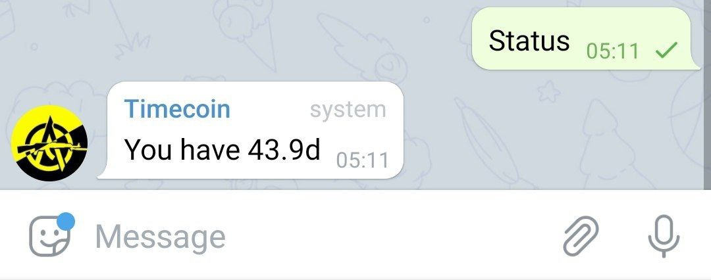
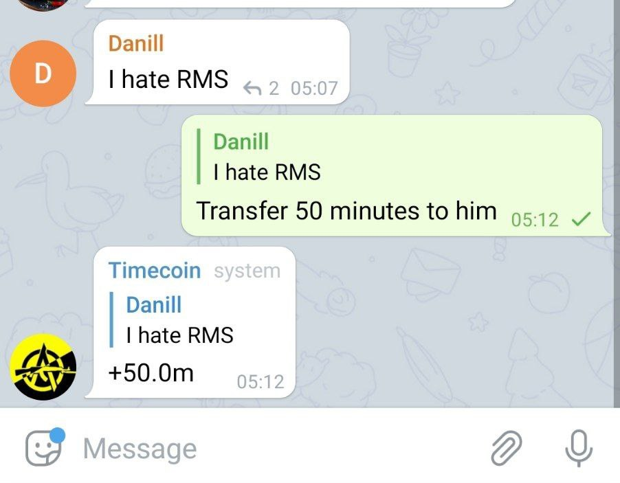
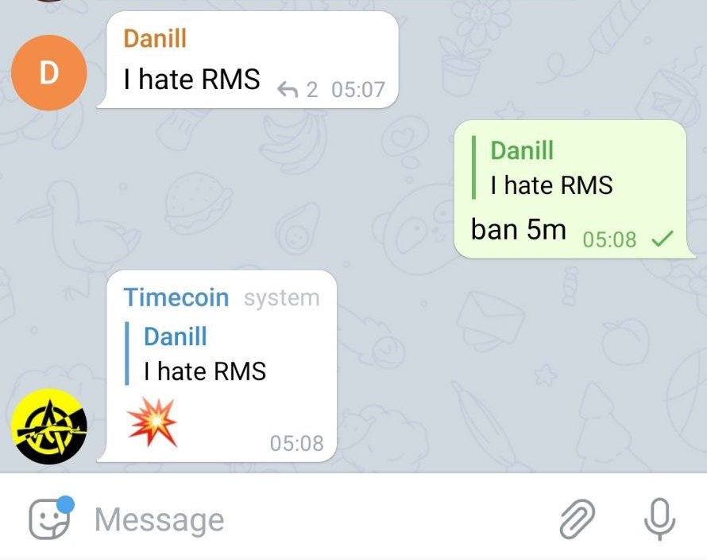
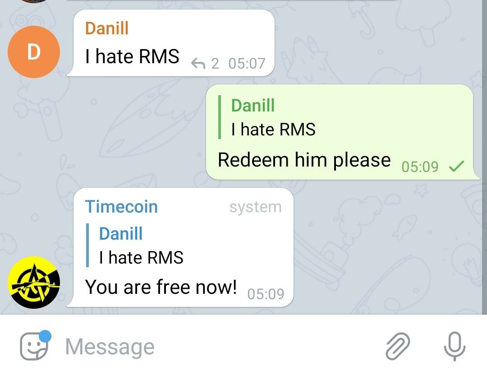

# Timecobot

Telegram bot provides time-based currency. The accumulated time can be used to block another user.
There are no discriminatory rules, administrators and moderators. Bot also can be used to pin
messages.

1. Each user accumulates time: 4 seconds every minute.
1. Time can be passed on to other people.
1. The accumulated time can be used to block another user.  
   User will remain in the chat, but user will not be able to write anything.
1. Time can be used to ransom the user from the ban.
1. Time can be used to pin messages.

## Usage

To start using the system, just add [`@timecobot`](https://t.me/timecobot) to the group with admin
rights. Bot understands spoken language (english and russian). Experiment!

### Check yourself status



### Transfer time to user



### Block user

User will remain in the chat, but he will not be able to write anything.



### Unblock user



## Build

```sh
./gradlew clean test shadowJar
```

Self-executable jar will be located in `build/libs`. To start long polling execute command

```sh
DATABASE_URL=rediss://example.com:37081 TOKEN=4760:zGTAaKGo java -jar build/libs/*-all.jar
```

## Deploy

[](https://cloud.digitalocean.com/apps/new?repo=https://github.com/demidko/timecobot/tree/main)

You can use a Redis cluster to store the time: specify the connection string via the `DATABASE_URL`
environment variable.

## TODO

1. 'Ban feature' to restrict group's admins

