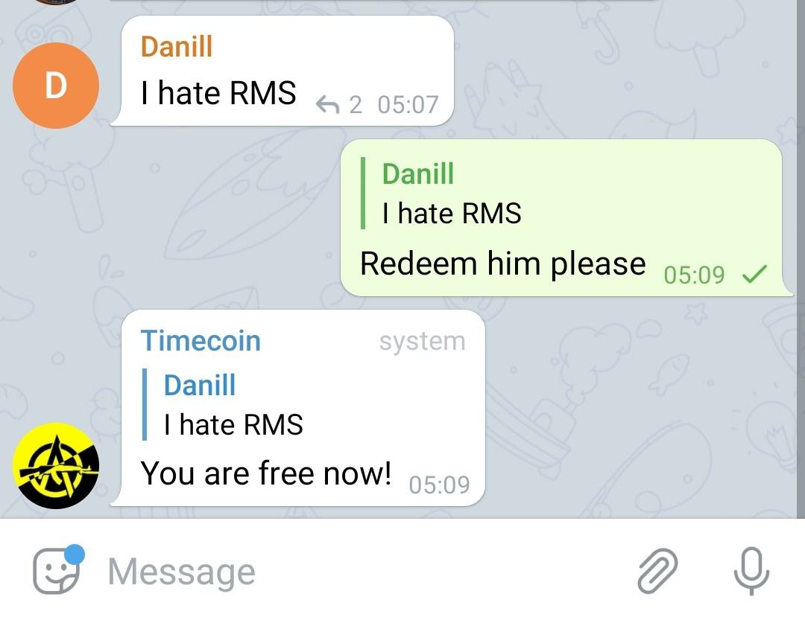

# Timecobot Democracy

Telegram bot provides a free time-based currency. The accumulated time can be used to block another
user. There are no discriminatory rules, administrators and moderators.

1. Each active user accumulates time spent on Telegram.
1. Time can be passed on to other people.
1. The accumulated time can be used to block another user.
1. Time can be used to redeem the user from the ban.

To start using the telegram, just add [`@Timecobot`](https://t.me/timecobot) to the group with admin
rights.

## Usage

The telegram understands spoken language. Experiment!

### Ban user


### Redeem user from ban



### Check yourself status


### Transfer time to user


## Build

```sh
./gradlew clean test shadowJar
```

Self-executable jar will be located in `build/libs`. To start long polling execute command

```sh
TOKEN=... java -jar build/libs/*.jar
```

## Deploy

[](https://cloud.digitalocean.com/apps/new?repo=https://github.com/demidko/timecobot/tree/main)

