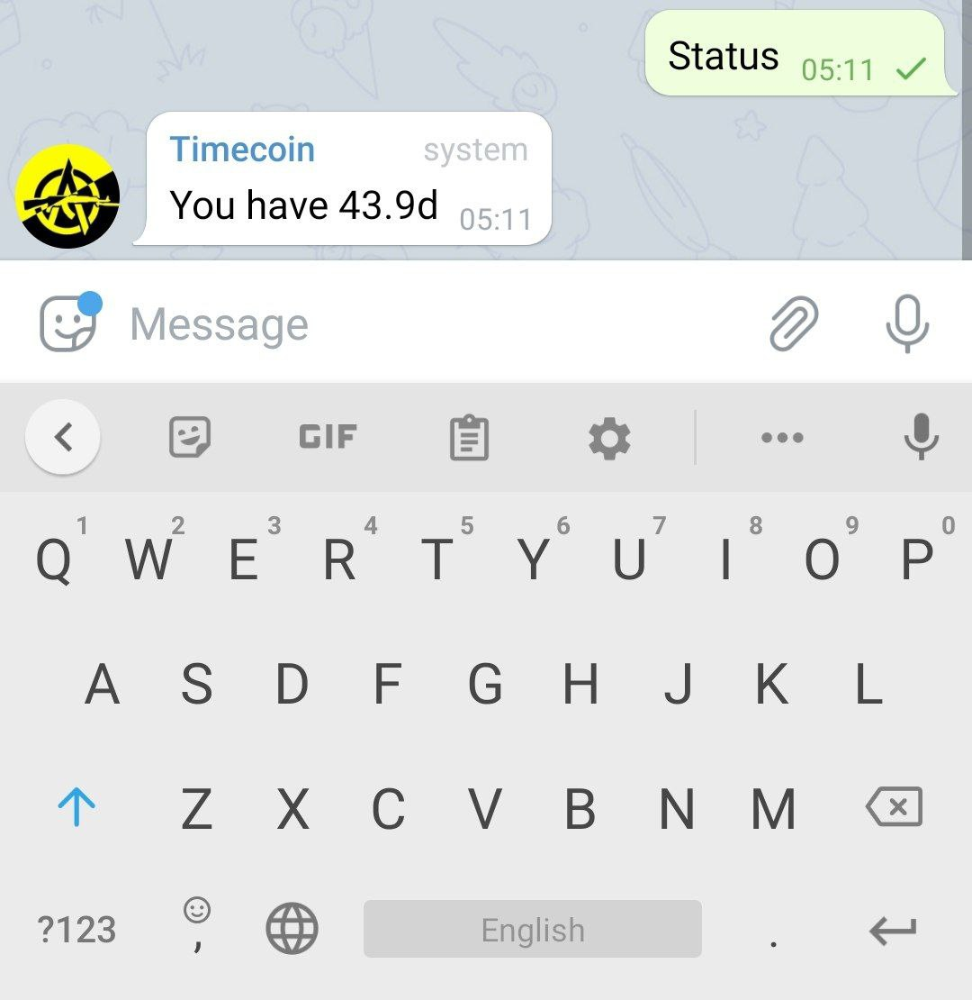
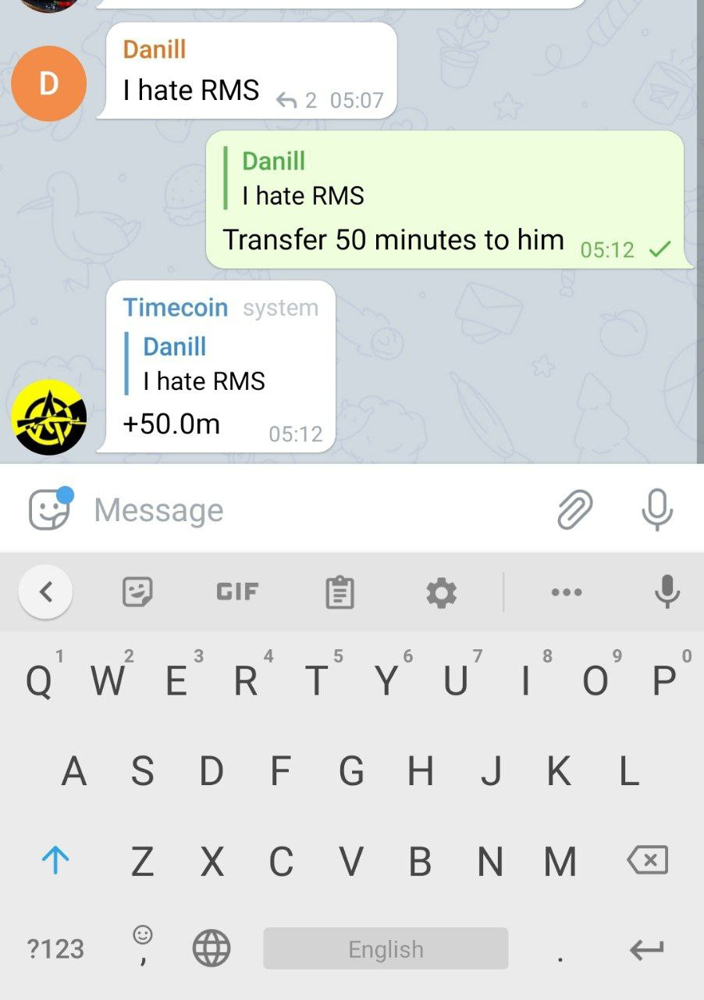
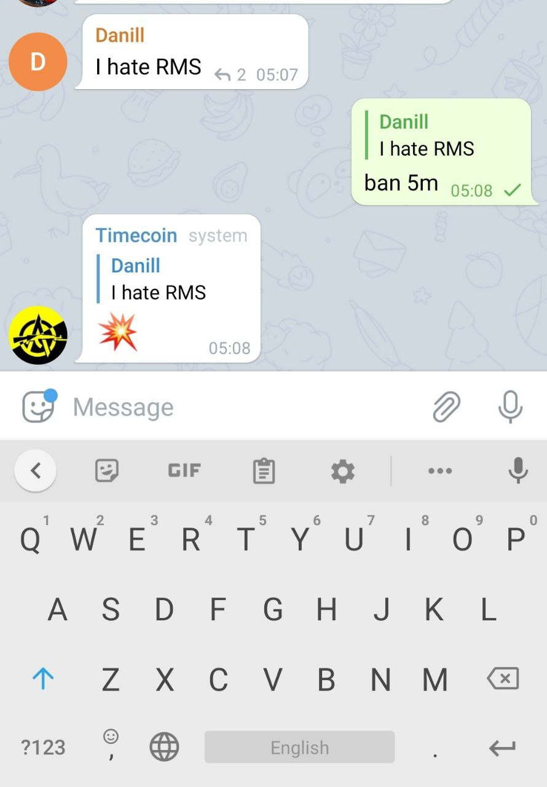

# Timecobot

Telegram bot provides time-based currency. The accumulated time can be used to block another user.
There are no discriminatory rules, administrators and moderators.

1. Each telegram user accumulates time. Minute by minute, hour by hour.
1. Time can be passed on to other people.
1. The accumulated time can be used to block another user.
1. Time can be used to ransom the user from the ban.

View comments on [Hacker News](https://news.ycombinator.com/item?id=27114668)

## Usage

To start using the system, just add [`@Timecobot`](https://t.me/timecobot) to the group with admin
rights. Bot understands spoken language (english and russian). Experiment!

### Check yourself status



### Transfer time to user



### Ban user



### User ransom


## Build

```sh
./gradlew clean test shadowJar
```

Self-executable jar will be located in `build/libs`. To start long polling execute command

```sh
TOKEN=... java -jar build/libs/*.jar
```

## Deploy

[](https://cloud.digitalocean.com/apps/new?repo=https://github.com/demidko/timecobot/tree/main)

